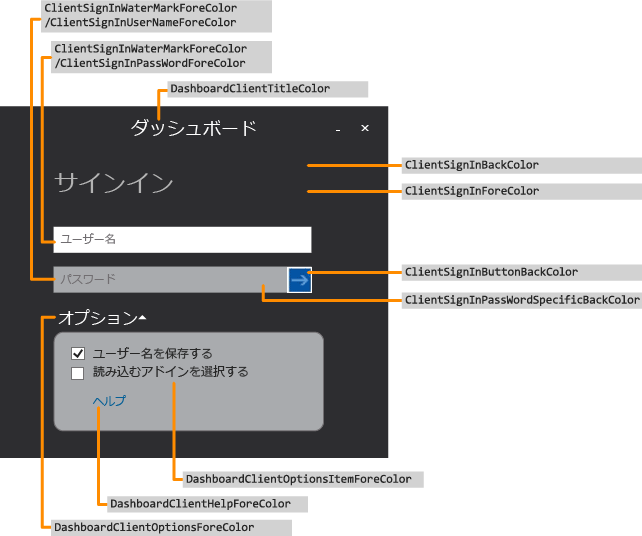
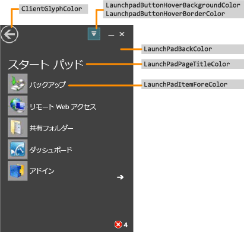
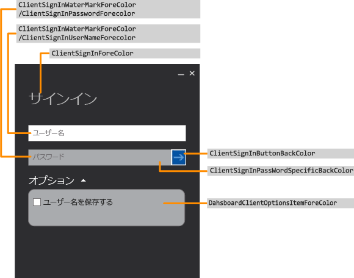
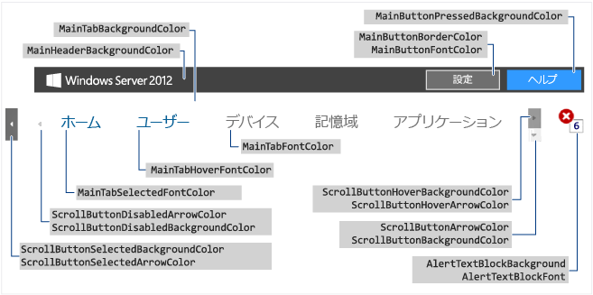
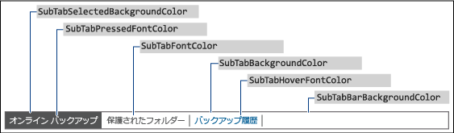
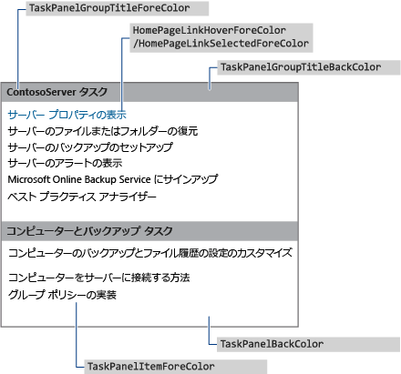
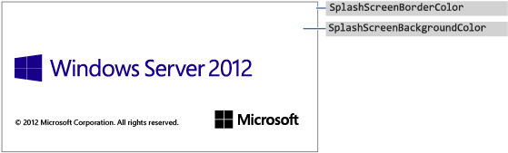
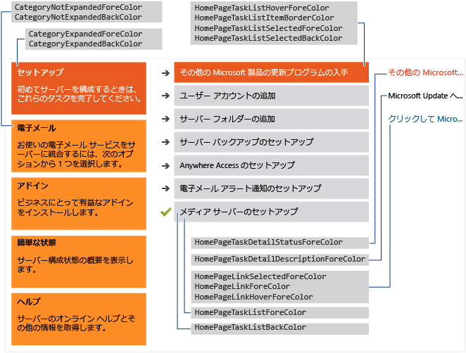

# <a name="change-the-color-scheme-of-the-dashboard-and-launchpad"></a>ダッシュボードとスタート パッドの配色の変更

>適用対象: windows Server 2016 Essentials、Windows Server 2012 R2 Essentials、Windows Server 2012 Essentials

ダッシュボードとスタート パッドの配色を変更するには、使用する色を XML 形式のファイルで定義して、その .xml ファイルをサーバーのフォルダーにインストールし、.xml ファイルの名前をレジストリ エントリで指定します。

## <a name="create-the-xml-file"></a>XML ファイルの作成
 次の例は、.xml ファイルの内容を示しています。

```xml
<DashboardTheme xmlns="https://www.microsoft.com/HSBS/Dashboard/Branding/2010">

  <!-- Hex color values overwriting default SKU theme colors -->

    <SplashScreenBackgroundColor HexValue="FFFFFFFF"/>
    <SplashScreenBorderColor HexValue="FF000000"/>
    <MainHeaderBackgroundColor HexValue="FF414141"/>
    <MainTabBackgroundColor HexValue="FFFFFFFF"/>
    <MainTabFontColor HexValue="FF999999"/>
    <MainTabHoverFontColor HexValue="FF0072BC"/>
    <MainTabSelectedFontColor HexValue="FF0072BC"/>
    <MainButtonPressedBackgroundColor HexValue="FF0072BC"/>
    <MainButtonFontColor HexValue="FFFFFFFF"/>
    <MainButtonBorderColor HexValue="FF6E6E6E"/>
    <ScrollButtonBackgroundColor HexValue="FFF0F0F0"/>
    <ScrollButtonArrowColor HexValue="FF999999"/>
    <ScrollButtonHoverBackgroundColor HexValue="FF999999"/>
    <ScrollButtonHoverArrowColor HexValue="FF6E6E6E"/>
    <ScrollButtonSelectedBackgroundColor HexValue="FF6E6E6E"/>
    <ScrollButtonSelectedArrowColor HexValue="FFFFFFFF"/>
    <ScrollButtonDisabledBackgroundColor HexValue="FFF8F8F8"/>
    <ScrollButtonDisabledArrowColor HexValue="FFCCCCCC"/>
    <AlertTextBlockBackground HexValue="FFFFFFFF"/>
    <AlertTextBlockFont HexValue="FF000000"/>
    <FontColor HexValue="FF000000"/>
    <SubTabBarBackgroundColor HexValue="FFFFFFFF"/>
    <SubTabBackgroundColor HexValue="FFFFFFFF"/>
    <SubTabSelectedBackgroundColor HexValue="FF414141"/>
    <SubTabBorderColor HexValue="FF787878"/>
    <SubTabFontColor HexValue="FF787878"/>
    <SubTabHoverFontColor HexValue="FF0072BC"/>
    <SubTabPressedFontColor HexValue="FFFFFFFF"/>
    <ListViewColor HexValue="FFFFFFFF"/>
    <PageBorderColor HexValue="FF999999"/>   
    <LaunchpadButtonHoverBorderColor HexValue="FF6BA0B4"/>
    <LaunchpadButtonHoverBackgroundColor HexValue="FF41788F"/>
    <ClientArrowColor HexValue="FFFFFFFF"/>
    <ClientGlyphColor HexValue="FFFFFFFF"/>
    <SplitterColor HexValue="FF83C6E2"/>
    <HomePageBackColor     HexValue="FFFFFFFF"/>
    <CategoryNotExpandedBackColor HexValue="FFFFB343"/>
    <CategoryExpandedBackColor HexValue="FFF26522"/>
    <CategoryNotExpandedForeColor HexValue="FF2A2A2A"/>
    <CategoryExpandedForeColor HexValue="FFFFFFFF"/>
    <HomePageTaskListForeColor    HexValue="FF2A2A2A"/>
    <HomePageTaskListBackColor HexValue="FFEAEAEA"/>
    <HomePageTaskListHoverForeColor      HexValue="FF2A2A2A"/>
    <HomePageTaskListItemBorderColor     HexValue="FF999999"/>
    <HomePageTaskListSelectedForeColor   HexValue="FFFFFFFF"/>
    <HomePageTaskListSelectedBackColor   HexValue="FFF26522"/>
    <HomePageTaskDetailStatusForeColor   HexValue="FFF26522"/>
    <HomePageTaskDetailDescriptionForeColor     HexValue="FF2A2A2A"/>
    <HomePageLinkForeColor HexValue="FF0072BC"/>
    <HomePageLinkSelectedForeColor HexValue="FF0054A6"/>
    <HomePageLinkHoverForeColor   HexValue="FF0072BC"/>
    <PropertyFormForeColor HexValue="FF2A2A2A"/>
    <PropertyFormTabHoverColor HexValue="FF0072BC"/>
    <PropertyFormTabSelectedColor HexValue="FFFFFFFF"/>
    <PropertyFormTabSelectedBackColor HexValue="FF414141"/>
    <TaskPanelBackColor HexValue="FFFFFFFF"/>
    <TaskPanelItemForeColor HexValue="FF2A2A2A"/>
    <TaskPanelGroupTitleForeColor HexValue="FF2A2A2A"/>
    <TaskPanelGroupTitleBackColor HexValue="FFCCCCCC"/>
    <DashboardClientBackColor HexValue="FF004050"/>
    <DashboardClientTitleColor HexValue="FFFFFFFF"/>
    <DashboardClientOptionsForeColor HexValue="FFFFFFFF"/>
    <DashboardClientOptionsItemForeColor HexValue="FF2A2A2A"/>
    <DashboardClientHelpForeColor HexValue="FF0054A6"/>
    <ClientSignInForeColor HexValue="FFFFFFFF"/>
    <ClientSignInWaterMarkForeColor HexValue="FF999999"/>
    <ClientSignInUserNameForeColor HexValue="FF2A2A2A"/>
    <ClientSignInPassWordSpecificBackColor HexValue="FFCCCCCC"/>
    <ClientSignInButtonBackColor HexValue="FF004050"/>
    <ClientSignInPassWordForeColor HexValue="FF2A2A2A"/>
    <LaunchPadBackColor HexValue="FF004050"/>
    <LaunchPadPageTitleColor HexValue="FFFFFFFF"/>
    <LaunchPadItemForeColor HexValue="FFFFFFFF"/>
  <LaunchPadItemHoverColor HexValue="33FFFFFF"/>
  <LaunchPadItemIconBackgroundColor HexValue="F2004050"/>
</DashboardTheme >

```

> [!IMPORTANT]
>  XML 要素は、前の例で一覧表示されている順で指定する必要があります。

> [!NOTE]
>  HexValue 属性の値は、いずれも色の 16 進値の例です。 使用する色には任意の 16 進値を入力できます。

 メモ帳や Visual Studio 2010 を使用して、カスタマイズする領域のタグを含む .xml ファイルを作成します。 ファイルはどのような名前でもかまいませんが、拡張子を .xml にする必要があります。 ダッシュボードおよびスタート パッドのカスタマイズ可能な領域の説明については、「[ダッシュボードとスタート パッドの変更可能な領域](Change-the-Color-Scheme-of-the-Dashboard-and-Launchpad.md#BKMK_Dashboard)」を参照してください。

#### <a name="to-install-the-xml-file"></a>.xml ファイルをインストールするには

1.  サーバーで、カーソルを画面の右上隅に移動して、[**検索**] をクリックします。

2.  検索ボックスに「**regedit**」と入力して、[**Regedit**] アプリケーションをクリックします。

3.  左のウィンドウで、[**HKEY_LOCAL_MACHINE**]、[**SOFTWARE**]、[**Microsoft**]、[**Windows Server**] の順に展開します。 [**OEM**] キーが存在しない場合は、キーを作成するために次の手順を完了する必要があります。

    1.  [**Windows Server**] を右クリックし、[**新規作成**] をクリックして、[**キー**] をクリックします。

    2.  キーの名前に「**OEM**」と入力します。

4.  [**OEM**] を右クリックし、[**新規**] をクリックし、[**文字列値**] をクリックします。

5.  文字列の名前として「**CustomColorScheme**」と入力し、**Enter** キーを押します。

6.  右のウィンドウで **CustomColorScheme** を右クリックして、[**変更**] をクリックします。

7.  ファイルの名前を入力し、[**OK**] をクリックします。

8.  ファイルを %programFiles%\Windows Server\Bin\OEM にコピーします。 OEM ディレクトリが存在しない場合は、ディレクトリを作成します。

##  <a name="dashboard-and-launchpad-areas-that-can-be-changed"></a><a name="BKMK_Dashboard"></a>ダッシュボードとスタートパッドの変更可能な領域
 ここでは、ダッシュボードとスタート パッドのカスタマイズ可能な領域の例を示します。

### <a name="examples"></a>例

####  <a name="figure-1-sign-in-page-of-the-dashboard"></a><a name="BKMK_Figure1"></a>図 1: ダッシュボードのサインインページ
 

####  <a name="figure-2-launchpad"></a><a name="BKMK_Figure2"></a>図 2: スタートパッド
 

####  <a name="figure-3-sign-in-page-of-the-launchpad"></a><a name="BKMK_Figure3"></a>図 3: スタートパッドのサインインページ
 

####  <a name="figure-4-dashboard-text"></a><a name="BKMK_Figure4"></a>図 4: ダッシュボードのテキスト
 

####  <a name="figure-5-subtab-border"></a><a name="BKMK_Figure5"></a>図 5: サブタブの枠線
 

####  <a name="figure-6-task-pane"></a><a name="BKMK_Figure6"></a>図 6: 作業ウィンドウ
 

####  <a name="figure-7a-product-splash-screen"></a><a name="BKMK_Figure9"></a>図 7a: 製品のスプラッシュスクリーン
 

#### <a name="figure-7b-home-page"></a>図 7b: ホーム ページ
 

## <a name="see-also"></a>参照
 [イメージの作成とカスタマイズ追加の](Creating-and-Customizing-the-Image.md)[カスタマイズ](Additional-Customizations.md)[展開のイメージの準備](Preparing-the-Image-for-Deployment.md)[カスタマーエクスペリエンスのテスト](Testing-the-Customer-Experience.md)